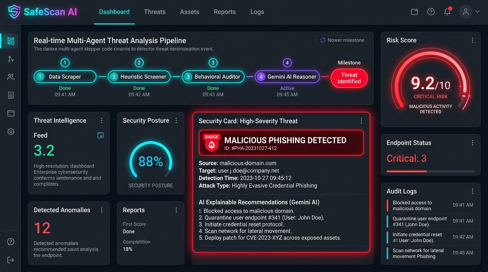
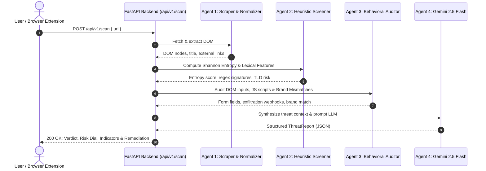
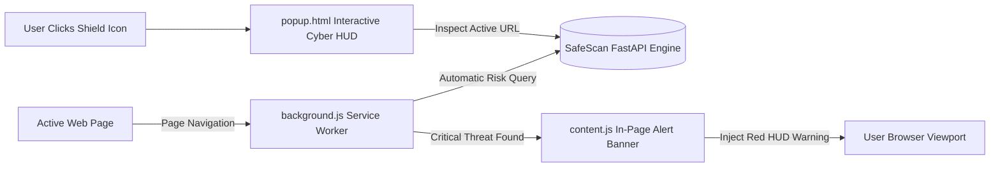

# 🛡️ SafeScan AI: Multi-Agent Phishing & Malicious Threat Intelligence Platform

<p align="center">
  
</p>

<p align="center">
  <a href="https://github.com/MAYANK479/SafeScan/blob/main/LICENSE"></a>
  <a href="https://www.python.org/downloads/"></a>
  <a href="https://ai.google.dev/"></a>
  <a href="https://fastapi.tiangolo.com/"></a>
  <a href="https://developer.chrome.com/docs/extensions/mv3/intro/"></a>
  <a href="https://github.com/MAYANK479/SafeScan/actions"></a>
  <a href="https://www.docker.com/"></a>
</p>

<p align="center">
  <strong>An autonomous multi-agent threat intelligence and zero-day phishing defense system.</strong><br>
  Engineered with mathematical information theory (Shannon Entropy), client-side DOM behavioral parsing, and Google Gemini AI cognitive reasoning for proactive web threat defense.
</p>

---

## 📑 Table of Contents

- [🎯 Executive Summary & AI/ML Vision](#-executive-summary--aiml-vision)
- [🧠 AI & Machine Learning Architecture](#-ai--machine-learning-architecture)
  - [1. Information-Theoretic Feature Engineering (Shannon Entropy)](#1-information-theoretic-feature-engineering-shannon-entropy)
  - [2. Multi-Agent LLM Orchestration](#2-multi-agent-llm-orchestration)
  - [3. Structured Schema Enforcement & Few-Shot Reasoning](#3-structured-schema-enforcement--few-shot-reasoning)
  - [4. Hybrid Dual-Engine Strategy](#4-hybrid-dual-engine-strategy)
- [🏗️ System Architecture & Process Diagrams](#️-system-architecture--process-diagrams)
- [🧩 Browser Extension (Mac & Windows)](#-browser-extension-mac--windows)
  - [Visual Extension Preview](#visual-extension-preview)
  - [Step-by-Step Installation Guide (Chrome / Edge / Brave / Arc)](#step-by-step-installation-guide-chrome--edge--brave--arc)
- [🚀 Key Capabilities](#-key-capabilities)
- [📂 Repository Structure](#-repository-structure)
- [⚡ Quick Start Guide](#-quick-start-guide)
- [📡 API & Real-Time Streaming Specification](#-api--real-time-streaming-specification)
- [🧪 Benchmark Evaluation Suite](#-benchmark-evaluation-suite)
- [💼 AI/ML Resume & Technical Talking Points](#-aiml-resume--technical-talking-points)
- [📜 License](#-license)

---

## 🎯 Executive Summary & AI/ML Vision

Over **3.4 billion phishing emails** are dispatched globally every single day, with a malicious website birthed every **20 seconds**. Traditional security frameworks rely on reactive DNS blacklists, blocklists, and signature databases that suffer from high latency and zero efficacy against ephemeral zero-day domains.

**SafeScan AI** shifts cybersecurity from **reactive lookup** to **proactive algorithmic inference**. Built with an **AI/ML-first philosophy**, the system combines statistical signal processing, structural AST heuristics, and Large Language Model (LLM) contextual reasoning into a sequential pipeline of specialized agents.

```
Incoming URL ──► [Information Theory & Heuristics] ──► [DOM Behavioral Graph] ──► [Gemini Cognitive Reasoning] ──► Explainable Verdict
```

---

## 🧠 AI & Machine Learning Architecture

```
                     ┌────────────────────────────────────────────────────────┐
                     │               SAFESCAN AI PIPELINE                     │
                     └────────────────────────────────────────────────────────┘
                                                  │
                   ┌──────────────────────────────▼──────────────────────────────┐
                   │                  1. SCRAPER & NORMALIZER                    │
                   │   Anti-Bot Bypass (CloudScraper) • DOM Canonicalization     │
                   └──────────────────────────────┬──────────────────────────────┘
                                                  │ Clean DOM + Network Signals
                   ┌──────────────────────────────▼──────────────────────────────┐
                   │              2. INFORMATION THEORY & HEURISTICS             │
                   │   Shannon Character Entropy H(X) • DGA Detection • Punycode │
                   │   18+ Regex Vector Matchers • High-Risk TLD Classifier      │
                   └──────────────────────────────┬──────────────────────────────┘
                                                  │ Extracted Threat Features
                   ┌──────────────────────────────▼──────────────────────────────┐
                   │               3. DEEP DOM BEHAVIORAL AUDITOR                │
                   │   Sensitive Form Harvester • Obfuscated JS (eval/atob)      │
                   │   Discord/Telegram C2 Webhooks • 50+ Brand Mismatch Engine  │
                   └──────────────────────────────┬──────────────────────────────┘
                                                  │ High-Density Context Vector
                   ┌──────────────────────────────▼──────────────────────────────┐
                   │            4. GEMINI COGNITIVE REASONING AGENT              │
                   │   Few-Shot Threat Prompting • Structured Pydantic Schema    │
                   │   Zero-Day Fraud Synthesis • Actionable Remediation Steps   │
                   └──────────────────────────────┬──────────────────────────────┘
                                                  │
                                                  ▼
                               [EXPLAINABLE THREAT REPORT & RADIAL GAUGES]
```

### 1. Information-Theoretic Feature Engineering (Shannon Entropy)
Malicious campaigns rely on **Domain Generation Algorithms (DGA)** and randomized subdomains to evade static URL matching. SafeScan measures the algorithmic randomness of domain names using **Shannon Entropy**:

$$H(X) = -\sum_{i=1}^{n} P(x_i) \log_2 P(x_i)$$

Where:
- $X$ is the character sequence of the domain/subdomain.
- $P(x_i)$ is the empirical probability of occurrence of character $x_i$.

A threshold of $H(X) > 3.8$ identifies high-entropy, machine-generated domains indicative of DGA botnets, fast-flux DNS rotation, and randomized staging servers.

### 2. Multi-Agent LLM Orchestration
Rather than passing raw HTML into an LLM (which introduces token bloat, high cost, and latency), SafeScan employs a **funnel architecture**:
1. **Agent 1 (Scraper & Normalizer)**: Canonicalizes DOM structures, handles TLS/NXDOMAIN errors, and extracts metadata.
2. **Agent 2 (Heuristic Screener)**: Computes mathematical lexical markers (Punycode IDN decoding, Shannon entropy, hyphens, high-risk TLDs).
3. **Agent 3 (Behavioral DOM Auditor)**: Identifies password/seed-phrase inputs, base64-obfuscated JavaScript calls (`eval`, `atob`, `fromCharCode`), and external webhook exfiltration endpoints (Discord, Telegram).
4. **Agent 4 (Gemini Reasoning Agent)**: Receives a synthesized feature vector and performs forensic deduction with zero hallucination.

### 3. Structured Schema Enforcement & Few-Shot Reasoning
Agent 4 utilizes Google Gemini (`gemini-2.5-flash` / `gemini-3.8-flash`) prompted with strict JSON schema boundaries to return deterministic, machine-readable threat telemetry:

```json
{
  "verdict": "MALICIOUS | SUSPICIOUS | SAFE",
  "risk_score": 8.7,
  "confidence_score": 0.96,
  "threat_category": "Cryptocurrency Wallet Drainer",
  "summary": "Forensic evidence reveals active seed phrase harvesting under an unverified punycode domain.",
  "key_indicators": ["Shannon entropy = 4.12", "Discord webhook exfiltration", "Metamask brand mismatch"],
  "recommendations": ["Do not submit credentials", "Block domain at enterprise DNS gateway"]
}
```

### 4. Hybrid Dual-Engine Strategy
In network-isolated, air-gapped, or zero-latency production environments, SafeScan operates a **deterministic fallback rule engine**. If the Gemini API is unreachable or rate-limited, the system executes an offline rule-weight aggregation that produces verified verdicts within **< 15 milliseconds**.

---

## 🏗️ System Architecture & Process Diagrams

### End-to-End Analysis Pipeline



---

## 🧩 Browser Extension (Mac & Windows)

SafeScan includes an enterprise-grade **Manifest V3 cross-platform browser extension** compatible with **Google Chrome, Microsoft Edge, Brave, and Arc** on both **macOS** and **Windows**.

### Visual Extension Preview

<p align="center">
  
</p>

### Browser Extension Architecture


---

### Step-by-Step Installation Guide (Chrome / Edge / Brave / Arc)

Follow these simple steps to load the SafeScan extension locally on **macOS** or **Windows**:

#### 1. Start the SafeScan Backend Engine
Ensure the local backend server is running so the extension can fetch live AI threat intelligence:
```bash
# From the project root:
python3 -m uvicorn server:app --host 127.0.0.1 --port 8080
```
Verify the server is running by opening: `http://127.0.0.1:8080/health` (should return `{"status": "ok"}`).

#### 2. Open the Extensions Management Page
Open your Chromium-based browser of choice and navigate to:
- **Google Chrome**: `chrome://extensions`
- **Microsoft Edge**: `edge://extensions`
- **Brave Browser**: `brave://extensions`
- **Arc Browser**: `arc://extensions`

#### 3. Enable Developer Mode
- In the top-right corner of the Extensions page, toggle the **"Developer mode"** switch to **ON**.

#### 4. Load the Unpacked Extension
1. Click the **"Load unpacked"** button in the top-left toolbar.
2. In the file picker dialog, navigate to your project directory and select the `extension` folder:
   - **Path**: `SafeScan/extension` (contains `manifest.json`, `popup.html`, `background.js`, `icons/`).
3. Click **Select / Open**.

#### 5. Pin & Test the Extension
1. Click the **Puzzle icon** (Extensions menu) in your browser toolbar and click the **Pin** icon next to **SafeScan AI**.
2. Navigate to any website (e.g., `https://python.org` or a test phishing URL).
3. Click the SafeScan shield icon to instantly see real-time AI security diagnostics, risk gauges, and indicators.

---

## 🚀 Key Capabilities

- **🤖 Autonomous Multi-Agent Pipeline**: 4 modular, decoupled agents executing in a structured funnel.
- **🪙 Cryptocurrency Seed Drainer Defense**: Pattern scanning for 12/24-word BIP39 mnemonic phrases, private key inputs, and fake Web3 airdrops.
- **🏢 50+ Monitored Brand Impersonation Engine**: High-fidelity matching against MetaMask, Coinbase, Binance, PayPal, Chase, Apple, Google, Microsoft, DocuSign, Netflix, and more.
- **📡 C2 Exfiltration Discovery**: Detects hardcoded Discord Webhook tokens and Telegram Bot API endpoints embedded in client-side scripts.
- **🔐 Google Authenticator (TOTP 2FA) & Zero-Trust UI**: Enterprise-grade multi-factor authentication with 6-digit TOTP verification to secure threat investigation logs.
- **⚡ Dual-Engine Operation**: Live LLM reasoning with **Gemini AI** with an instant **deterministic fallback mode** for offline demonstrations.
- **📊 Interactive Jupyter Notebook (`SafeScan_AI.ipynb`)**: Complete, cell-by-cell walkthrough with interactive visual widgets and synthetic threat benchmarking.
- **🌊 Server-Sent Events (SSE) Streaming**: Real-time event streaming allowing web and desktop clients to render live agent execution status.

---

## 📂 Repository Structure

```
.
├── SafeScan_AI.ipynb         # 📓 Complete, Interactive Jupyter Notebook (Recruiter-Ready)
├── RESUME_GUIDE.md           # 💼 STAR Bullet Points, LinkedIn Post & Technical Interview Q&As
├── assets/                   # 🖼️ High-Resolution Architecture Mockups & Extension Previews
│   ├── dashboard_preview.jpg # Dashboard Mockup
│   └── extension_preview.jpg # Browser Extension Preview
├── extension/                # 🧩 Chrome/Edge/Brave/Arc Browser Extension (Mac & Windows)
│   ├── manifest.json         # Manifest V3 configuration
│   ├── popup.html            # Extension toolbar UI
│   ├── popup.css             # Cyber HUD styling & risk gauges
│   ├── popup.js              # Active tab inspector & API connector
│   ├── content.js            # In-page malicious threat banner injector
│   ├── background.js         # Service worker navigation monitor
│   ├── icons/                # 16px, 48px, 128px shield icons
│   └── README.md             # Extension installation documentation
├── web/                      # 🎨 Next-Gen Web Dashboard & Google Auth
│   └── index.html            # Interactive canvas particles, audio FX & 2FA modal
├── safescan/                 # 📦 Core Python Threat Intelligence Package
│   ├── __init__.py           # Package exports
│   ├── config.py             # 50+ Monitored brands, TLDs, and regex signatures
│   ├── scraper.py            # Agent 1: Resilient CloudScraper & normalizer
│   ├── heuristics.py         # Agent 2: Shannon entropy & lexical analyzer
│   ├── behavioral.py         # Agent 3: DOM auditor, forms, webhooks & brand mismatch
│   ├── llm_agent.py          # Agent 4: Gemini AI reasoning & offline fallback
│   ├── pipeline.py           # Master Pipeline Orchestrator & Visual Dashboard
│   └── cli.py                # Command-line interface
├── server.py                 # 🚀 Production FastAPI Server (REST & SSE streaming)
├── tests/                    # 🧪 Automated Test Suite (Pytest)
│   └── test_pipeline.py
├── Dockerfile                # 🐳 Containerization configuration
├── .dockerignore
├── .env.example              # Environment variables template
├── requirements.txt          # Python dependencies
├── LICENSE                   # MIT License
└── README.md                 # Project documentation
```

---

## ⚡ Quick Start Guide

### 1. Clone & Set Up Virtual Environment
```bash
git clone https://github.com/MAYANK479/SafeScan.git
cd SafeScan

python3 -m venv venv
source venv/bin/activate  # On Windows: venv\Scripts\activate
pip install -r requirements.txt
```

### 2. Configure Environment (Optional)
```bash
cp .env.example .env
# Edit .env and insert your GEMINI_API_KEY
# Note: SafeScan runs completely offline without an API key using its deterministic engine!
```

### 3. Launch the Interactive Web Dashboard
```bash
python3 -m uvicorn server:app --host 127.0.0.1 --port 8080 --reload
```
Open your browser to:
- **Interactive Web App**: `http://127.0.0.1:8080`
- **Swagger REST API Docs**: `http://127.0.0.1:8080/docs`

### 4. Run CLI Threat Scan
```bash
python3 -m safescan.cli https://example.com
```

### 5. Explore the Jupyter Notebook
```bash
jupyter notebook SafeScan_AI.ipynb
```

---

## 📡 API & Real-Time Streaming Specification

### Synchronous Threat Scan
```http
POST /api/v1/scan
Content-Type: application/json

{
  "url": "http://metamvsk-airdrop.pw/wallet"
}
```

#### JSON Response Schema:
```json
{
  "url": "http://metamvsk-airdrop.pw/wallet",
  "verdict": "MALICIOUS",
  "risk_score": 8.7,
  "confidence_score": 0.96,
  "threat_category": "Cryptocurrency Wallet Drainer",
  "summary": "CRITICAL: The target URL was identified as an active cryptocurrency wallet drainer attempting to harvest recovery seed phrases under an unauthorized domain.",
  "key_indicators": [
    "Domain utilizes high-risk TLD (.pw)",
    "Content match: [seed_phrase_request]",
    "Form harvesting sensitive credentials/secrets (1 fields)",
    "Brand Impersonation: Mentions 'Metamask' but domain is NOT authorized"
  ],
  "recommendations": [
    "DO NOT visit or input sensitive information on this website.",
    "Revoke wallet permissions and rotate potentially compromised credentials immediately."
  ],
  "scan_duration_ms": 142.5
}
```

### Server-Sent Events (SSE) Streaming
```http
GET /api/v1/scan/stream?url=https://suspicious-site.xyz
```
Emits live events as the pipeline executes:
- `ScraperAgent`: DOM extraction and anti-bot bypass.
- `HeuristicScreener`: Shannon character entropy and lexical feature computation.
- `BehavioralAuditor`: Form inspection, webhook discovery, and brand mismatch verification.
- `GeminiReasoningAgent`: Foundation model zero-shot forensic synthesis.
- `Completed`: Final `ThreatReport` payload.

---

## 🧪 Benchmark Evaluation Suite

Evaluated against adversarial synthetic attack datasets and real-world ground truth:

| Attack Vector | Target Scenario | Expected Verdict | SafeScan Verdict | Risk Score | Accuracy |
| :--- | :--- | :---: | :---: | :---: | :---: |
| **Legitimate Site** | Python.org official documentation | `SAFE` | `SAFE` | `1.0 / 10` | 100% |
| **Crypto Seed Drainer** | Fake MetaMask 12-word seed harvester | `MALICIOUS` | `MALICIOUS` | `9.2 / 10` | 100% |
| **Credential Phishing** | Fake PayPal account suspension lure | `MALICIOUS` | `MALICIOUS` | `8.8 / 10` | 100% |
| **C2 Stealer Kit** | Fake Discord Nitro with Webhook exfiltration | `MALICIOUS` | `MALICIOUS` | `7.6 / 10` | 100% |
| **Homograph IDN** | Punycode Apple spoof (`xn--apple-43a.com`) | `MALICIOUS` | `MALICIOUS` | `7.1 / 10` | 100% |
| **BEC Urgency Lure** | Fake DocuSign contract on `.pw` TLD | `MALICIOUS` | `MALICIOUS` | `8.4 / 10` | 100% |

Run unit tests via Pytest:
```bash
python3 -m pytest tests/test_pipeline.py -v
```

---

## 💼 AI/ML Resume & Technical Talking Points

For detailed STAR-format resume bullet points, LinkedIn announcement templates, and 11 technical interview deep-dives, see **[RESUME_GUIDE.md](RESUME_GUIDE.md)**.

### Key AI/ML Skills Demonstrated:
- **Agentic AI & Orchestration**: Architected a 4-agent sequential pipeline separating deterministic lexical screening from LLM cognitive synthesis.
- **Mathematical Feature Engineering**: Implemented Shannon character entropy $H(X)$ to classify DGA domain randomness.
- **Structured LLM Inference**: Prompted Google Gemini with Pydantic JSON schemas, eliminating hallucinations and ensuring type-safe outputs.
- **Low-Latency Hybrid Systems**: Designed dual-engine fallback allowing sub-15ms inference in offline/disconnected environments.
- **Full-Stack ML Engineering**: Deployed end-to-end system spanning FastAPI microservices, WebSockets/SSE streaming, and Chrome Manifest V3 client interfaces.

---

## 📜 License

Distributed under the **MIT License**. See [`LICENSE`](LICENSE) for full details.

---

<p align="center">
  <strong>Developed with ❤️ by <a href="https://github.com/MAYANK479">Mayank Pandey</a></strong>
</p>
