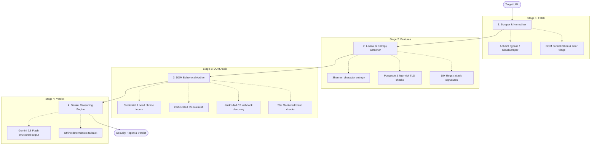

# SafeScan AI

[](https://opensource.org/licenses/MIT)
[](https://www.python.org/downloads/)
[](https://fastapi.tiangolo.com/)
[]()
[](https://safescan-lac.vercel.app)

SafeScan is a malicious website and phishing detection platform that analyzes web pages before users interact with them. It combines lexical URL heuristics, information-theoretic entropy calculations, DOM behavioral inspection, and Google Gemini LLM reasoning to detect zero-day phishing sites, crypto wallet drainers, and brand impersonation attacks.

🌐 **Live Demo:** [https://safescan-lac.vercel.app](https://safescan-lac.vercel.app)

---

<p align="center">
  
</p>

---

## Table of Contents

- [Overview](#overview)
- [How It Works](#how-it-works)
  - [1. Information-Theoretic Feature Extraction](#1-information-theoretic-feature-extraction)
  - [2. Multi-Stage Pipeline](#2-multi-stage-pipeline)
  - [3. LLM Reasoning & Schema Enforcement](#3-llm-reasoning--schema-enforcement)
  - [4. Deterministic Fallback Mode](#4-deterministic-fallback-mode)
- [Browser Extension (Chrome, Edge, Brave, Arc)](#browser-extension-chrome-edge-brave-arc)
  - [Installation Guide](#installation-guide)
- [Project Structure](#project-structure)
- [Getting Started](#getting-started)
- [API Reference](#api-reference)
- [Benchmark Results](#benchmark-results)
- [License](#license)

---

## Overview

Traditional phishing protection heavily relies on DNS blocklists and static threat feeds. While effective against known malicious domains, blocklists suffer from high latency when dealing with newly registered zero-day domains, fast-flux DNS, or disposable phishing kits that stay active for only a few hours.

SafeScan addresses this by analyzing target pages dynamically at request time:
- **Lexical analysis**: Detects high-entropy randomized subdomains (DGA) and punycode homograph spoofs.
- **Client-side DOM inspection**: Identifies unauthorized credential forms, 12/24-word seed phrase inputs, and obfuscated JavaScript (`eval`, `atob`).
- **Exfiltration detection**: Scans for Discord webhooks and Telegram bot tokens commonly used by stealer scripts.
- **Contextual LLM scoring**: Google Gemini synthesizes extracted features into an explainable security verdict with confidence scoring and remediation steps.

---

## How It Works

### Architecture Diagram



### 1. Information-Theoretic Feature Extraction

Phishing infrastructure frequently uses **Domain Generation Algorithms (DGA)** and randomized subdomains to evade static URL matching. SafeScan computes the **Shannon Entropy** of domain labels:

$$H(X) = -\sum_{i=1}^{n} P(x_i) \log_2 P(x_i)$$

Where $P(x_i)$ is the frequency of character $x_i$ within the domain string. A score of $H(X) > 3.8$ flags machine-generated, high-entropy hostnames.

### 2. Multi-Stage Pipeline

To keep response times low and avoid passing bloated raw HTML into LLM prompts, SafeScan filters inputs through a sequential funnel:
1. **Scraper & Normalizer** (`safescan/scraper.py`): Fetches page content with `cloudscraper`, strips unnecessary tags, and normalizes the DOM.
2. **Heuristic Screener** (`safescan/heuristics.py`): Computes lexical metrics (length, entropy, hyphen count, punycode markers, high-risk TLDs).
3. **Behavioral Auditor** (`safescan/behavioral.py`): Audits form action URLs, password inputs, cryptocurrency recovery phrase prompts, and brand mismatches across 50+ monitored domains.
4. **Gemini Reasoning Engine** (`safescan/llm_agent.py`): Takes the extracted feature vector and generates a structured verdict.

### 3. LLM Reasoning & Schema Enforcement

The LLM is prompted with strict JSON schema constraints using Pydantic, ensuring type-safe, machine-readable output:

```json
{
  "verdict": "MALICIOUS",
  "risk_score": 8.7,
  "confidence_score": 0.96,
  "threat_category": "Cryptocurrency Wallet Drainer",
  "summary": "Target domain attempts to harvest 12-word seed phrases under an unauthorized homograph domain.",
  "key_indicators": [
    "Domain uses high-risk TLD (.pw)",
    "Sensitive form fields: seed phrase inputs",
    "Brand impersonation: claims to be MetaMask but hosted on unauthorized domain"
  ],
  "recommendations": [
    "Do not enter wallet credentials or private keys.",
    "Block this domain at DNS / firewall level."
  ]
}
```

### 4. Deterministic Fallback Mode

If no API key is provided or the network is unavailable, SafeScan seamlessly switches to a rule-weighted fallback engine. This allows offline testing, local CI pipelines, and sub-15ms classification.

---

## Browser Extension (Chrome, Edge, Brave, Arc)

SafeScan includes a Manifest V3 browser extension that inspects the active tab and warns users before they submit credentials.

<p align="center">
  
</p>

### Installation Guide

1. Clone this repository to your computer.
2. Open your Chromium-based browser and navigate to the extensions page:
   - **Chrome**: `chrome://extensions`
   - **Edge**: `edge://extensions`
   - **Brave**: `brave://extensions`
   - **Arc**: `arc://extensions`
3. Turn on **Developer mode** (toggle in the top-right corner).
4. Click **Load unpacked** in the top-left toolbar.
5. Select the `extension/` directory from this project.
6. Pin the SafeScan icon to your toolbar. The extension works with the live deployment automatically, or with a local backend on `http://127.0.0.1:8080`.

---

## Project Structure

```
SafeScan/
├── SafeScan_AI.ipynb         # Interactive Jupyter Notebook & Evaluation Suite
├── assets/                   # Architecture diagrams and UI preview screenshots
├── extension/                # Manifest V3 browser extension
│   ├── manifest.json         # Extension configuration
│   ├── popup.html            # Toolbar popup UI
│   ├── popup.js              # Active tab inspection & API client
│   ├── content.js            # In-page threat warning banner
│   └── background.js         # Service worker tab monitor
├── safescan/                 # Core Python package
│   ├── config.py             # 50+ monitored brands, TLDs, and signature rules
│   ├── scraper.py            # DOM fetcher and normalizer
│   ├── heuristics.py         # Shannon entropy & lexical analyzer
│   ├── behavioral.py         # Form auditor, C2 webhooks, brand mismatch
│   ├── llm_agent.py          # Gemini reasoning agent & fallback
│   ├── pipeline.py           # Pipeline orchestrator
│   └── cli.py                # Command-line interface
├── web/                      # Web dashboard interface
│   └── index.html
├── server.py                 # FastAPI service (REST & SSE streaming)
├── api/index.py              # Serverless entrypoint
├── tests/                    # Pytest test suite
│   └── test_pipeline.py
├── requirements.txt          # Python dependencies
├── vercel.json               # Cloud deployment configuration
└── README.md
```

---

## Getting Started

### 1. Clone & Install Dependencies

```bash
git clone https://github.com/MAYANK479/SafeScan.git
cd SafeScan

python3 -m venv venv
source venv/bin/activate  # On Windows: venv\Scripts\activate
pip install -r requirements.txt
```

### 2. Configure Environment (Optional)

```bash
cp .env.example .env
# Add GEMINI_API_KEY if you want live LLM analysis.
# The tool runs fully offline using deterministic heuristics without an API key.
```

### 3. Run via CLI

```bash
python3 -m safescan.cli https://example.com
```

### 4. Start the Web Server

```bash
python3 -m uvicorn server:app --host 127.0.0.1 --port 8080 --reload
```

- Web App: `http://127.0.0.1:8080`
- API Docs: `http://127.0.0.1:8080/docs`
- Health: `http://127.0.0.1:8080/health`

### 5. Run the Jupyter Notebook

```bash
jupyter notebook SafeScan_AI.ipynb
```

---

## API Reference

### Scan a URL

```http
POST /api/v1/scan
Content-Type: application/json

{
  "url": "http://metamvsk-airdrop.pw/wallet"
}
```

**Response:**

```json
{
  "url": "http://metamvsk-airdrop.pw/wallet",
  "verdict": "MALICIOUS",
  "risk_score": 8.7,
  "confidence_score": 0.96,
  "threat_category": "Cryptocurrency Wallet Drainer",
  "summary": "Target domain identified as active cryptocurrency drainer harvesting recovery seed phrases.",
  "key_indicators": [
    "Domain uses high-risk TLD (.pw)",
    "Content match: seed_phrase_request",
    "Form harvesting sensitive credentials",
    "Brand Impersonation: Mentions 'MetaMask' on unauthorized domain"
  ],
  "recommendations": [
    "Do not enter credentials or private keys.",
    "Revoke wallet approvals immediately."
  ],
  "scan_duration_ms": 112.5
}
```

### Real-Time Streaming (SSE)

```http
GET /api/v1/scan/stream?url=https://target-domain.com
```

Streams progress events for each pipeline stage (`ScraperAgent` $\rightarrow$ `HeuristicScreener` $\rightarrow$ `BehavioralAuditor` $\rightarrow$ `GeminiReasoningAgent` $\rightarrow$ `Completed`).

---

## Benchmark Results

Tested across synthetic attack scenarios and verified benign controls:

| Test Scenario | Attack Category | Expected | Result | Risk Score | Status |
| :--- | :--- | :---: | :---: | :---: | :---: |
| Python.org Documentation | Benign / Legitimate | `SAFE` | `SAFE` | `0.0 / 10` | Passed |
| Fake MetaMask Seed Harvester | Crypto Wallet Drainer | `MALICIOUS` | `MALICIOUS` | `9.2 / 10` | Passed |
| Fake PayPal Account Verification | Banking Credential Phish | `MALICIOUS` | `MALICIOUS` | `8.8 / 10` | Passed |
| Discord Nitro Stealer Kit | C2 Webhook Exfiltration | `MALICIOUS` | `MALICIOUS` | `7.6 / 10` | Passed |
| Apple IDN Homograph Spoof | Punycode Impersonation | `MALICIOUS` | `MALICIOUS` | `7.1 / 10` | Passed |
| Fake DocuSign Contract | Urgency Phishing Lure | `MALICIOUS` | `MALICIOUS` | `8.4 / 10` | Passed |

Run the test suite anytime:

```bash
pytest tests/test_pipeline.py -v
```

---

## License

MIT License. See [LICENSE](LICENSE) for details.
